# 🧠 Contexto de Adaptación: PRL España para la Cooperativa Incoop
## Guía de Orientación Operativa y Normativa para el Proyecto de Prevención

Este documento proporciona el contexto institucional y las directrices normativas necesarias para adaptar la plataforma genérica **PRL España** a la realidad específica de **Incoop, SCCL**, una cooperativa de iniciativa social catalana con más de 450 trabajadores en activo.

---

## 🏢 1. Radiografía Operativa de Incoop

Para orientar la PRL, primero debemos comprender la naturaleza de las actividades y centros de Incoop. No es una industria pesada ni una constructora; es una entidad de servicios a las personas, fuertemente feminizada y descentralizada.

### Líneas de Actividad y sus Riesgos Clave:

```mermaid
flowchart TD
    root["Servicios Incoop"] --> EB["Escoles Bressol"]
    root --> CG["Casals de Gent Gran"]
    root --> LE["Lleure Educatiu"]
    root --> EC["Equipaments Cívics"]
    root --> LA["L'Agència"]

    EB --> EB1["Ergonomía: Mobiliario bajo, carga física"]
    EB --> EB2["Agentes Biológicos: Contagios infantiles"]
    EB --> EB3["Colectivo Sensible: Maternidad"]

    CG --> CG1["Movilización de dependientes"]
    CG --> CG2["Riesgo de Caídas y Golpes"]
    CG --> CG3["Carga Psicosocial: Apoyo emocional"]

    LE --> LE1["Exterior: Insolación, deshidratación"]
    LE --> LE2["Cortes, caídas, contusiones"]
    LE --> LE3["Alta estacionalidad: Monitores"]

    EC --> EC1["Público: Conflicto verbal"]
    EC --> EC2["Eléctrico e Incendio"]
    EC --> EC3["Seguridad en eventos"]

    LA --> LA1["Seguridad vial: Desplazamientos"]
    LA --> LA2["Logística: Catering y mercancías"]
```



```text
Estructura de Servicios y Riesgos (Incoop)
├── Escoles Bressol
│   ├── Riesgo Ergonómico: Mobiliario bajo, carga física
│   ├── Agentes Biológicos: Contagios infantiles
│   └── Colectivo Sensible: Protección a la maternidad
├── Casals de Gent Gran
│   ├── Movilización de dependientes
│   ├── Riesgo de Caídas y Golpes
│   └── Carga Psicosocial: Apoyo emocional
├── Lleure Educatiu
│   ├── Actividades al aire libre: Insolación, deshidratación
│   ├── Cortes, caídas, contusiones
│   └── Alta estacionalidad: Monitores eventuales
├── Equipaments Cívics
│   ├── Atención al público: Conflicto verbal
│   ├── Riesgo Eléctrico y de Incendio
│   └── Seguridad en eventos comunitarios
└── L'Agència
    ├── Seguridad vial: Transporte y desplazamientos
    └── Logística de catering y mercancías
```


| Línea de Servicio | Población Laboral Típica | Entorno de Trabajo | Riesgos PRL Críticos |
| :--- | :--- | :--- | :--- |
| **Escoles Bressol (21 centros)** | Educadoras infantiles, personal de limpieza y comedor. | Escuelas infantiles municipales. | Ergonomía (posturas forzadas por mobiliario infantil, levantamiento de niños), biológico (contagios víricos), ruido y protección a la maternidad/lactancia (Art. 26 LPRL). |
| **Casals de Gent Gran (10 centros)** | Coordinadores, dinamizadores, auxiliares de geriatría. | Centros cívicos o espacios cedidos. | Ergonomía (movilización de usuarios con movilidad reducida), caídas al mismo nivel, psicosocial (gestión del duelo/dependencia). |
| **Lleure Educatiu (28 proyectos)** | Monitores de tiempo libre, directores de campamento. | Espacios abiertos, naturaleza, instalaciones deportivas. | Caídas a distinto nivel, sobreesfuerzo, insolación/exposición solar, picaduras, gestión de primeros auxilios y alta estacionalidad (contratación temporal masiva). |
| **Equipaments Culturals (10 centros)** | Personal de recepción, conserjes, técnicos de sala. | Centros culturales e históricos. | Caídas al mismo nivel, manipulación de cargas, riesgos psicosociales (atención al público conflictivo), riesgos eléctricos menores en salas de espectáculos. |

---

## ⚖️ 2. Marco Normativo Singular para Incoop en Cataluña

Al adaptar el proyecto **PRL España** para Incoop, el marco normativo estatal (Ley 31/1995 y reales decretos) debe complementarse con la normativa y los órganos autonómicos catalanes:

### 1. Organismos de Vigilancia y Soporte:
* **Inspecció de Treball de Catalunya (ITC):** Órgano con competencia sancionadora transferida a la Generalitat de Catalunya.
* **ICSSL (Institut Català de Seguretat i Salut Laboral):** Ente autonómico encargado de la promoción de la salud laboral, guías técnicas específicas (muy útiles sus guías sobre ergonomía en guarderías) y campañas de prevención.

### 2. Coordinación de Actividades Empresariales (CAE - RD 171/2004):
Incoop opera en un escenario de **concurrencia de actividades** muy complejo:
* **Espacios de Terceros:** Las escuelas infantiles, centros cívicos y casals de ancianos son propiedad de los **Ayuntamientos (Ajuntaments)**. Incoop actúa como **contratista** que ejecuta un servicio público en instalaciones ajenas.
* **Obligación de Intercambio CAE:** Incoop debe coordinarse obligatoriamente con el departamento de PRL del Ayuntamiento correspondiente (p. ej., a través de plataformas de licitación o CAE como *CTAIMA* o *e-Coordina*). Debe subir evaluaciones de riesgos de sus trabajadores y fichas de aptitud, y a su vez exigir las evaluaciones del centro de trabajo al propietario (Ayuntamiento).

### 3. Vigilancia de la Salud en el Convenio del Tercer Sector Social:
* Las evaluaciones médicas periódicas (Art. 22 LPRL) deben estar muy enfocadas a la **salud física y mental** de los cuidadores y educadores, incluyendo analíticas específicas para personal expuesto a agentes biológicos en escuelas infantiles.

---

## 🛠️ 3. Adaptaciones Específicas para el Software "PRL España"

Si deseas adaptar la aplicación web interactiva que tienes en `PRL España` para que sirva como herramienta de gestión interna o portal de prevención para Incoop, te recomiendo enfocar los cambios en las siguientes áreas de código y datos:

### A. Modularización de Auditorías por Servicio:
El checklist actual de auditoría en la plataforma web debe permitir seleccionar la actividad específica de Incoop. Sugiero estructurar las preguntas bajo estos bloques:
1. **Auditoría Bressol:**
   - ¿Disponen las cunas y cambiadores de alturas regulables ergonómicamente?
   - ¿Existe protocolo de desinfección de juguetes y gestión de pañales (riesgo biológico)?
   - ¿Se dispone de plan de evacuación infantil (simulacros con cunas de evacuación)?
2. **Auditoría Gent Gran / Centre de Dia:**
   - ¿Tienen las zonas de paso barras de apoyo y pavimentos antideslizantes?
   - ¿Se imparte formación en movilización de cargas y personas dependientes?
3. **Auditoría Lleure / Campaments:**
   - ¿Disponen los monitores de EPIs para exterior (gorra, crema solar homologada)?
   - ¿Existe un botiquín revisado y al día por cada grupo de actividad?

### B. Mapas de Obligaciones por Roles de Cooperativa:
Redefinir los roles del mapa actual del software para adaptarlos a la estructura de Incoop:
* **Rol 1: Directora de Centre (Mando Intermedio / Delegada):** Custodia de los planes de autoprotección, control de la CAE en su centro, garante de que el personal nuevo reciba la formación del Art. 19 LPRL.
* **Rol 2: Personal de Aula/Cuidado (Educadora/Cuidador):** Cumplimiento de posturas ergonómicas, notificación de incidencias/riesgos inmediatos, uso de calzado antideslizante.
* **Rol 3: Àrea de Persones (RH / Estructura):** Gestión de bajas por contingencia profesional (accidente de trabajo) o común (IT), control de las evaluaciones médicas anuales, archivo de justificantes de entrega de EPIs.
* **Rol 4: Control de Gestió / PMO (Tu rol):** Supervisión de costes de PRL asignados a licitaciones, contratación de seguros de responsabilidad civil y coordinación con el Servicio de Prevención Ajeno (SPA) para rentabilizar la inversión en seguridad.

### C. Fichas de Capacitación específicas para Servicios Sociales:
Sustituir o ampliar las fichas actuales de capacitación del proyecto con temarios adaptados:
* **Ficha Infantil:** *"Ergonomía en la Educación de 0-3 años"* y *"Protocolo de Agentes Biológicos en Aulas"*.
* **Ficha Dependencia:** *"Movilización segura de personas con movilidad reducida"*.
* **Ficha Psicosocial:** *"Burnout y fatiga por compasión en el cuidado de personas"* (muy relevante dada la sobrecarga del sector).

---

## 🧘 4. Consejos para la Gestión Aislada de este Proyecto

Dado que vas a trabajar este proyecto de forma separada a la consultoría financiera directa:
1. **Usa el "Consultor IA" integrado:** Si vas a programar o maquetar las nuevas vistas en React, puedes usar el motor del Consultor IA del proyecto cargando las normativas específicas de PRL de la Generalitat o convenios colectivos del tercer sector catalán en el archivo `src/data/lprl.ts` y derivados.
2. **Usa la estructura `.agent/workflows/`:** Para añadir nuevas normas (p. ej., convenios colectivos o normas de seguridad escolar) o añadir fichas de capacitación interactivas, sigue los workflows estructurados en la carpeta `.agent/workflows/` que ya están optimizados para este repositorio de PRL España.

---

*Nota: He guardado este documento resumen de contexto en la carpeta `docs` del proyecto `PRL España` para que te sirva como guía maestra mientras modificas el código o planificas las tareas de forma independiente.*
